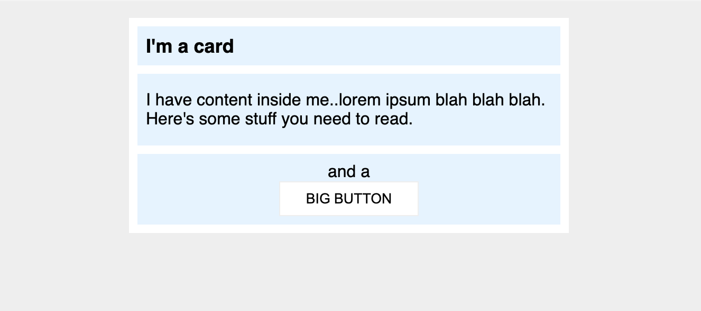

# Indicaciones:

El siguiente documento es más parecido a algo que van a hacer en el mundo real. Será necesario cambiar un poco más que el margin y el padding para logar el resultado deseado.

## Desired outcome

### Objetivos:

- Hay 8px entre el borde de la tarjeta y su contenido (las secciones azules).
- Hay una separación de 8px entre cada una de las secciones azules dentro de la tarjeta.
- El título de la tarjeta utiliza una fuente de 16px.
- Hay 8px entre el texto del título y el borde de la sección del título.
- La sección de contenido tiene un espacio de 16px en la parte superior e inferior, y 8px en cada lado.
- Todo dentro de la sección `.button-container` está centrado, y hay un relleno de 8px.
- El Botón Grande está centrado en su propia línea.
- El Botón Grande tiene un espacio de 24px en los lados, y 8px en la parte superior e inferior.